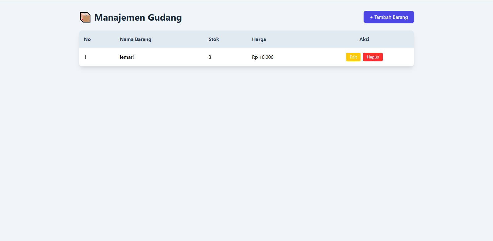
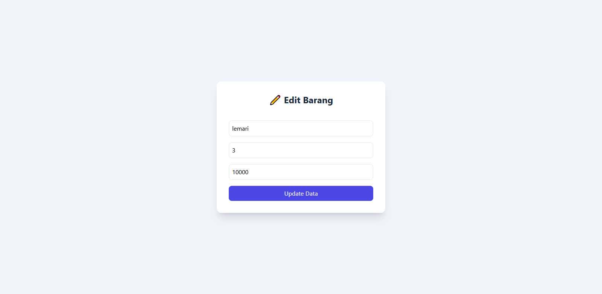

# 📦 CRUD Gudang Barang  
*(PHP Native + Tailwind CSS)*

Nama : fauzan zianul haq
bidang : Web Programming
univ : uin sgd
## 📝 Deskripsi Project
Aplikasi **CRUD Gudang Barang** adalah aplikasi web sederhana berbasis **PHP Native** yang digunakan untuk mengelola data barang di gudang, meliputi proses **Create, Read, Update, dan Delete (CRUD)**.

Aplikasi ini dibuat untuk memenuhi tugas mata kuliah **Web Programming**, dengan menerapkan konsep:
- Client–Server
- HTTP Request (GET & POST)
- Frontend dan Backend
- Database dan Operasi CRUD

---

## 🛠️ Teknologi yang Digunakan
- **Backend** : PHP Native  
- **Frontend** : HTML + Tailwind CSS (CDN)  
- **Database** : MySQL  
- **Web Server** : Apache (Laragon / XAMPP)  
- **Version Control** : Git  

---

## 📂 Struktur Folder Project
gudang-crud/
│
├── config/
│ └── koneksi.php
│
├── barang/
│ ├── index.php
│ ├── tambah.php
│ ├── simpan.php
│ ├── edit.php
│ ├── update.php
│ └── hapus.php
│
├── images/
│ ├── halaman-home.png
│ ├── halaman-tambah.png
│ └── halaman-edit.png
│
├── database.sql

---

CREATE DATABASE gudang;
USE gudang;

## 🔄 Fitur CRUD
Aplikasi ini menyediakan fitur **CRUD (Create, Read, Update, Delete)** untuk mengelola data barang di gudang, dengan penjelasan sebagai berikut:

| Fitur  | Penjelasan |
|--------|------------|
| Create | Menambahkan data barang baru ke dalam database |
| Read   | Menampilkan seluruh data barang yang tersimpan |
| Update | Mengubah data barang yang sudah ada |
| Delete | Menghapus data barang dari database |

## 📸 Dokumentasi Screenshot Aplikasi

Dokumentasi screenshot digunakan untuk menunjukkan tampilan aplikasi CRUD Gudang Barang sebagai bukti bahwa aplikasi berjalan dengan baik.
### Halaman Utama

### Form Tambah Barang

### Form Edit Barang

## 🎯 Kesimpulan
Aplikasi **CRUD Gudang Barang** ini berhasil mengimplementasikan konsep dasar **Web Programming** menggunakan **PHP Native** dan **MySQL**. Dengan tambahan **Tailwind CSS**, aplikasi ini memiliki tampilan yang modern, responsif, dan user-friendly sehingga memudahkan pengguna dalam mengelola data barang di gudang.

